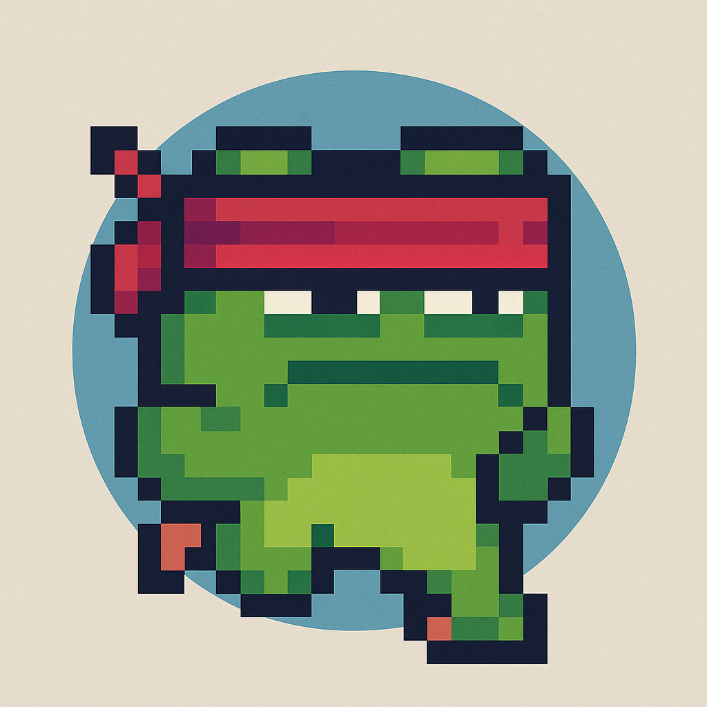
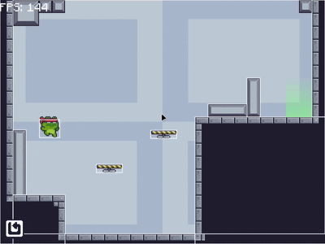

<p align="center"><p align="center">Bobo`s Bounce</h1>
<p align="center"><a href="#project-description">Project Description</a> - <a href="#key-features">Key Features</a> - <a href="#libraries">Libraries</a></p>

<p align="center">

## Project Description

A game created using Love2D, which can be modified or added levels through the Tiled software, this game is very basic and can easily be programmed, all assets used are free here: <a href="advhttps://pixelfrog-assets.itch.io/pixel-adventure-1">Free Assets</a>

## Key Features

You can adjust the maximum level that the game has at _./scenes/levelScene.lua_.

```lua
function scene:enter(previous, manager, scenes, ...)
    self.manager = manager
    self.scenes = scenes
    self.screenWidth, self.screenHeight = love.graphics.getWidth(), love.graphics.getHeight()

    love.graphics.setBackgroundColor(0.18, 0.18, 0.18)

    self.text = love.graphics.newText(love.graphics.getFont(), "LEVELS")

    if not love.filesystem.getInfo("playerData.json") then
        love.filesystem.write("playerData.json", json.encode({
            unlockedLevel = {1}
        }))
        self.unlockedLevel = {1}
    else
        self.unlockedLevel = json.decode(love.filesystem.read("playerData.json")).unlockedLevel
    end
    self.maxLevel = 2
 -- ...

```

You can refer to my level designs using Tiled at _./levels/_.

## Libraries

**STI**: <a href="https://github.com/karai17/Simple-Tiled-Implementation">Simple-Tiled-Implementation</a>  
**MOONSHINE**: <a href="https://github.com/vrld/moonshine">Shaders</a>  
**WINDFIELD**: <a href="https://github.com/a327ex/windfield">Physics</a>  
**ANIM8**: <a href="https://github.com/kikito/anim8">Animations</a>  
**BATON**: <a href="https://github.com/tesselode/baton">Input</a>  
**JSON** <a href="https://github.com/rxi/json.lua">Json For Lua</a>  
**ROOMY** <a href="https://github.com/tesselode/roomy">Scene Manager</a>
